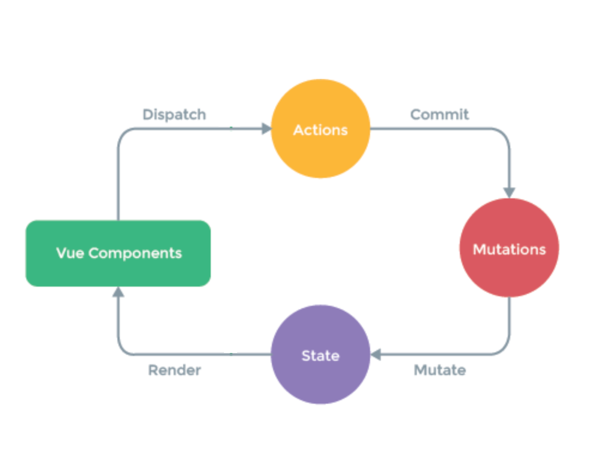

## Vue 状态管理

Vuex 是 vue.js 应用程序的状态管理模式，它采用**集中式存储**管理应用的所有组件的状态，
并以相应的规则保证状态以一种可预测的方式发生变化。

### 状态管理应主要包含以下几个部分

- state 驱动应用的数据源

- view 以声明方式将 state 映射到视图

- actions 相应用户输入的变化

### 单向数据流

以上是一种典型的**单向数据流**方案

<p align="center">
  
</p>

但是，当我们的应用遇到**多个组件共享状态时**，单向数据流的简洁性很容易被破坏

- 多个视图依赖于同一状态

- 来自不同视图的行为需要变更同一状态

对于问题一，传参的方法对于多层嵌套的组件将会非常繁琐，且对于兄弟组件之间的状态传递无能为力

对于问题二，经常会采用父子组件直接引用或者通过事件来变更和同步状态的多份拷贝

这些模式非常脆弱，通常会导致无法维护的代码

### 状态管理模式

把不同组件的**共享状态**抽取出来，以一个全局单例模式管理。这种模式下，我们的组件树构成一个
巨大的视图，不管在树的哪个位置，任何组件都能**获取状态**或**触发行为**。

通过定义和隔离状态管理中的各种概念，并通过强制规则维持视图和状态间的独立性，我们的代码将会变得
更加结构化和易维护

<p align="center">
  
</p>

核心概念

- State(store)

- Actions

- Mutations

此时 Action 与 Mutation 概念是相同的

> Redux 中是 dispatch Action
>
> Vuex 中是 commit Mutation

### State

每一个 Vuex 应用的核心就是 store（仓库），它包含着应用中的共享状态（state）。

**Vuex 的 store 和单纯的全局对象的不同点**

- Vuex 的状态存储是响应式的。当 Vue 组件从 store 中读取状态的时候，若 store 中的状态发生变化，那么**相应的组件**
  也会相应地得到高效更新。

- 你不能直接改变 store 中的状态。改变 store 中的唯一途径就是显式地**提交（commit）mutation**。
  这样可以跟踪每一个状态的改变

### 最简单的实例

```
import Vue from 'vue'
import Vuex from 'vuex'

Vue.use(Vuex)

const store = new Vuex.Store({
  state: {
    count: 0
  },
  mutaions: {
    increment(state) {
      state.count++
    }
  }
})
```

如何从 store 仓库获取数据

```
store.state.count // -> 0
```

如何提交 commit mutation

```
store.commit('increment')
```

### Actions

此时 Action 与 Mutation 本质是相同的，只不过是不同的叫法而已

> React Redux 中是 dispatch Action
>
> Vue Vuex 中是 commit Mutation

用户所有与 state 的交互，都应该定义为 Action

```
increment(state) {
  state.count++
}
```
