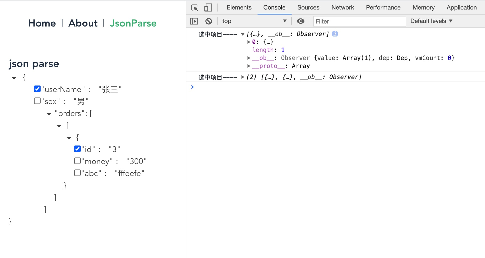

## JsonParse 组件

| 属性     | 说明                   | 类型                                                   | 默认值 |
| -------- | ---------------------- | ------------------------------------------------------ | ------ |
| jsonData | 需要传入 json 的行解析 | `object[]`                                             | -      |
| onSelect | 选择回调               | `(value: []) => { console.log('select item', value) }` | -      |

### Usage

```
import JsonParse from "@/components/JsonParse/index.vue";

const testData: any = [
  { id: 1, type: 0, key: "userName", value: "张三", layer: 1 },
  { id: 2, type: 0, key: "sex", value: "男", layer: 1 },
  { id: 3, type: 1, key: "orders", value: "[", layer: 1 },
  { id: 4, type: 1, key: "", value: "[", layer: 2 },
  { id: 5, type: 1, key: "", value: "{", layer: 3 },
  { id: 6, type: 0, key: "id", value: "3", layer: 4 },
  { id: 7, type: 0, key: "money", value: "300", layer: 4 },
  { id: 8, type: 0, key: "abc", value: "fffeefe", layer: 4 },
  { id: 9, type: 2, key: "", value: "}", layer: 3 },
  { id: 10, type: 2, key: "", value: "]", layer: 2 },
  { id: 11, type: 2, key: "", value: "]", layer: 1 },
];
handleSelect(value: any): void {
  console.log("选中项目----", value);
}

<JsonParse :jsonData="testData" @onSelect="handleSelect"></JsonParse>
```

### 效果展示

<p>
  
</p>
